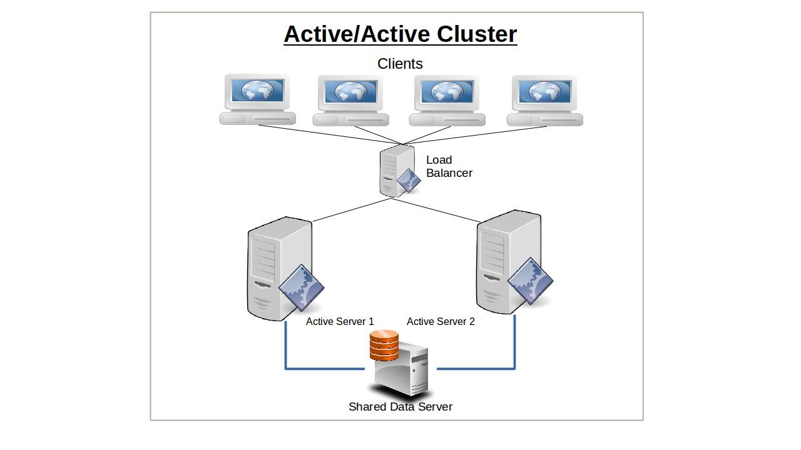
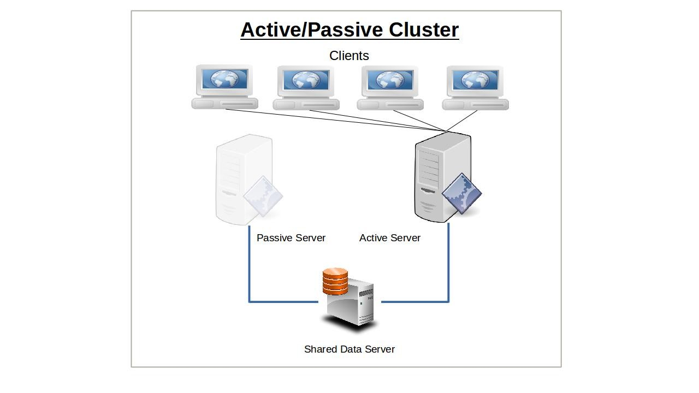

# Linux High Availability Clustering

## What is clustering?
- Computer cluster technology puts clusters of systems together to provide better system reliability and performance. Cluster server systems connect a group of servers together in order to jointly provide processing service for the clients in the network.

:::info
High-Availability cluster a.k.a Failover-cluster (active-passive cluster) is one of the most widely used cluster types in the production environment. This type of cluster provides you the continued availability of services even one of the node from the group of computer fails. If the server running application has failed for some reason (hardware failure), cluster software (pacemaker) will restart the application on another node.
:::

## Types of clusters
- High-availability Cluster (Known as an HA Cluster or failover cluster)
  - High-availability clusters can be grouped into two subsets : 
    - Active-Active High-Availability clusters, where a service runs on multiple nodes, thus leading to shorter failover times.
    
    - Active-Passive High-Availability clusters, where a service only runs on one node at a time.
    

- Storage Clusters
  - In a storage cluster, all members provide a single cluster file system that can be accessed by different server systems. The provided file system maybe used to read and write data simultaneously. This is useful for providing high availability of application data, like web server content, without requiring multiple redundant copies of the same data. An example of a cluster file system is GFS2.

## High-availability clusters Concepts and Techniques

### Resources
A resource is any cluster element such a cluster node, database, mount point, or network interface card that has been registered with a cluster manager. If an element is not registered with the cluster manager, then the cluster manager will not be aware of that element and the cluster manager will not include that element in cluster managing operations.

### Resource groups
A resource group is a logical collection of resources. The resource group is a very powerful construct because relationships and constraints can be defined on resource groups that simplify performing complex administration tasks on the resources in those groups.

### Failover
Failover is switching to a redundant or standby computer server, system, hardware component or network upon the failure or abnormal termination of the previously active application, server, system, hardware component, or network in a computer network. Failover and switchover are essentially the same operation, except that failover is automatic and usually operates without warning, while switchover requires human intervention.

### Fencing
Fencing is the process of isolating a node of a computer cluster or protecting shared resources when a node appears to be malfunctioning.
As the number of nodes in a cluster increases, so does the likelihood that one of them may fail at some point. The failed node may have control over shared resources that need to be reclaimed and if the node is acting erratically, the rest of the system needs to be protected. Fencing may thus either disable the node, or disallow shared storage access, thus ensuring data integrity.

### Shared Storage
A shared-disk file system uses a storage area network (SAN) to allow multiple computers to gain direct disk access at the block level. Access control and translation from file-level operations that applications use to block-level operations used by the SAN must take place on the client node. The most common type of clustered file system, the shared-disk file system —by adding mechanisms for concurrency control—provides a consistent and serializable view of the file system, avoiding corruption and unintended data loss even when multiple clients try to access the same files at the same time. Shared-disk file-systems commonly employ some sort of fencing mechanism to prevent data corruption in case of node failures, because an unfenced device can cause data corruption if it loses communication with its sister nodes and tries to access the same information other nodes are accessing.

### Quorum 
A quorum device helps a cluster manager make cluster management decisions when the cluster manager's normal decision process does not produce a clear choice.
To select an action to take, a cluster manager counts the number of cluster domain nodes that support each of the potential actions. The cluster manager then selects the action that is supported by most of the cluster domain nodes. If the same number of cluster domain nodes supports more than one choice, then the cluster manager refers to a quorum device to make the choice.

## References
- https://en.wikipedia.org/wiki/Computer_cluster
- https://en.wikipedia.org/wiki/Clustered_file_system
- https://en.wikipedia.org/wiki/Fencing_(computing)
- https://en.wikipedia.org/wiki/High-availability_cluster
- https://www.ibm.com/docs/no/db2/11.5?topic=component-quorum-devices-support-pacemaker