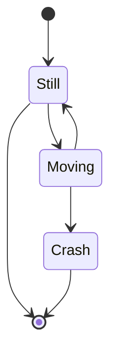
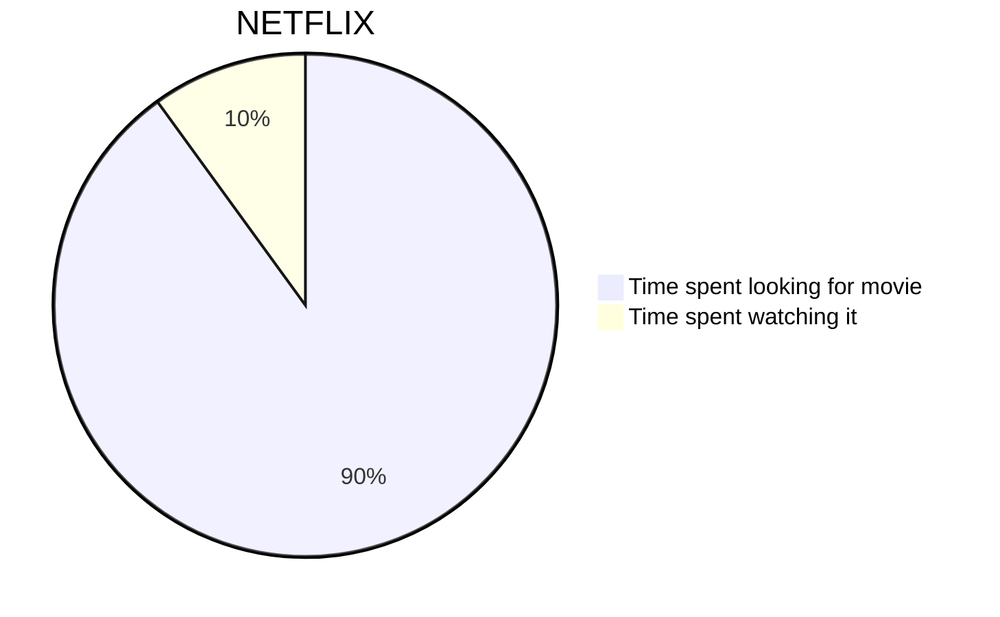
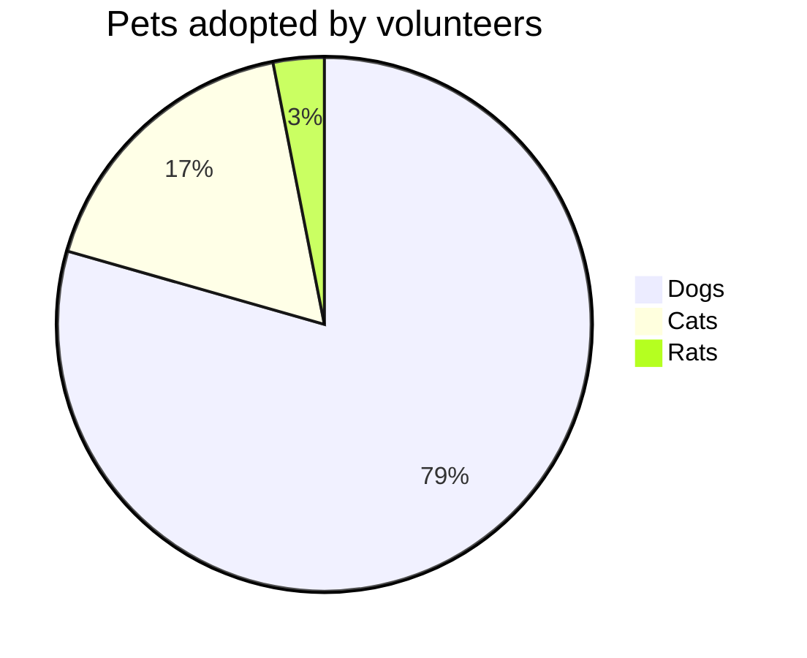
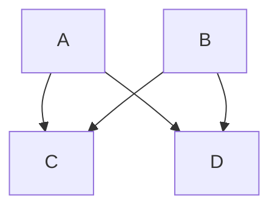
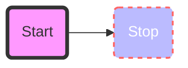
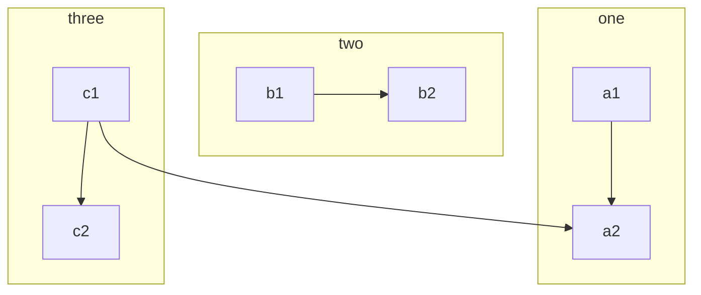
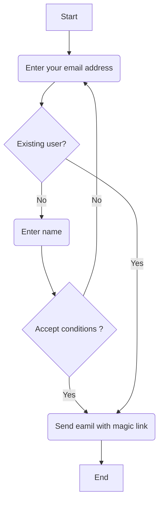
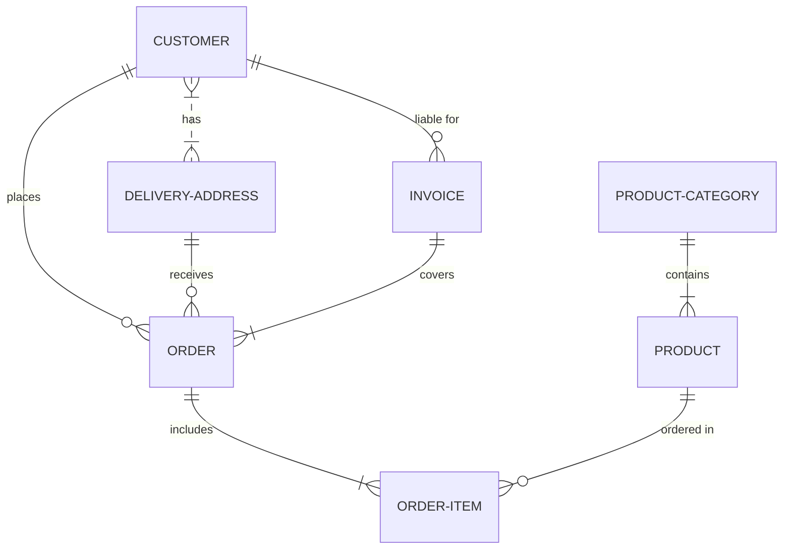
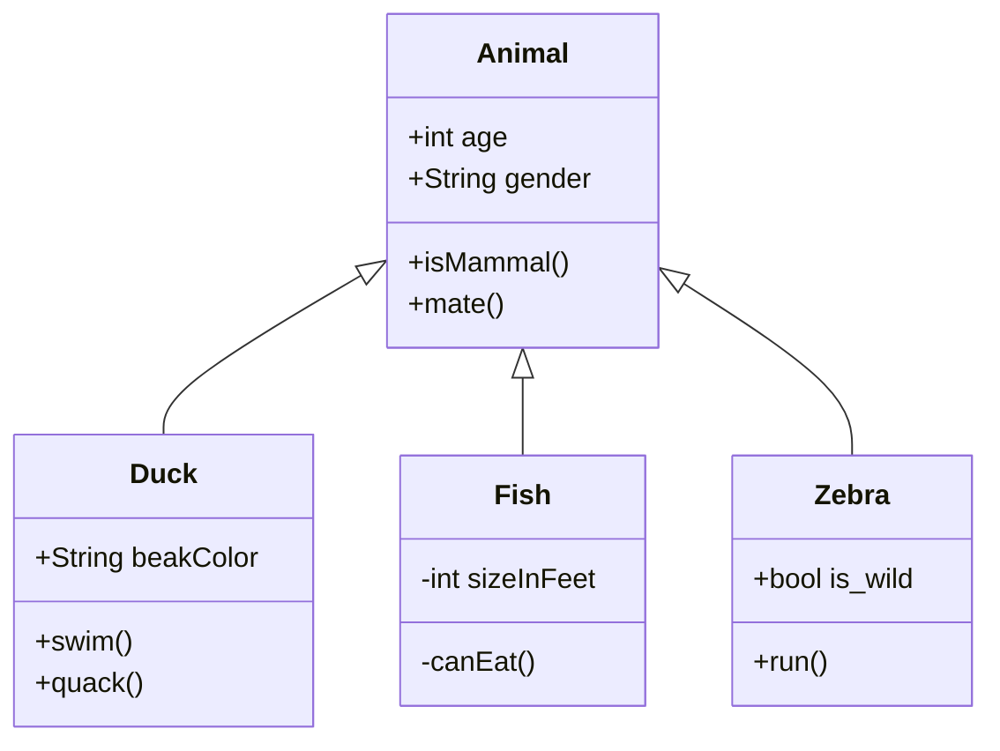

# Mermaid Diagram Examples

## State Diagrams
https://mermaid.js.org/syntax/stateDiagram.html#state-diagrams

````md title="State Diagram"

`````


## Pie chart diagrams
https://mermaid.js.org/syntax/pie.html#pie-chart-diagrams

````md title="Pie Chart 1"

````


````md title="Pie Chart 2"

````


## Flow Charts
https://mermaid.js.org/syntax/stateDiagram.html#state-diagrams

````md title="Flow Chart 1"

````


````md title="Flow Chart 2"

````


````md title="Flow Chart 3"

````


````md title="Flow Chart 4"

````


````md title="Flow Chart 5"

````


## ER Diagrams
https://mermaid.js.org/syntax/entityRelationshipDiagram.html#entity-relationship-diagrams

````md title="ER Diagram"

````


## Class Diagrams 
https://mermaid.js.org/syntax/classDiagram.html#class-diagrams


````md title="Class Diagram"

````

## Graph Diagrams

````md title="Graph 1"
```mermaid
graph TD
A[Christmas] -->|Get money| B(Go shopping)
B --> C{Let me think}
C -->|One| D[Laptop]
C -->|Two| E[iPhone]
C -->|Three| F[fa:fa-car Car]
```
````
```mermaid
graph TD
A[Christmas] -->|Get money| B(Go shopping)
B --> C{Let me think}
C -->|One| D[Laptop]
C -->|Two| E[iPhone]
C -->|Three| F[fa:fa-car Car]
```

````md title="Graph 2"
graph LR;
 client([client])-. Ingress-managed <br> load balancer .->ingress[Ingress];
 ingress-->|routing rule|service[Service];
 subgraph cluster
 ingress;
 service-->pod1[Pod];
 service-->pod2[Pod];
 end
 classDef plain fill:#ddd,stroke:#fff,stroke-width:4px,color:#000;
 classDef k8s fill:#326ce5,stroke:#fff,stroke-width:4px,color:#fff;
 classDef cluster fill:#fff,stroke:#bbb,stroke-width:2px,color:#326ce5;
 class ingress,service,pod1,pod2 k8s;
 class client plain;
 class cluster cluster;
````
```mermaid
graph LR;
 client([client])-. Ingress-managed <br> load balancer .->ingress[Ingress];
 ingress-->|routing rule|service[Service];
 subgraph cluster
 ingress;
 service-->pod1[Pod];
 service-->pod2[Pod];
 end
 classDef plain fill:#ddd,stroke:#fff,stroke-width:4px,color:#000;
 classDef k8s fill:#326ce5,stroke:#fff,stroke-width:4px,color:#fff;
 classDef cluster fill:#fff,stroke:#bbb,stroke-width:2px,color:#326ce5;
 class ingress,service,pod1,pod2 k8s;
 class client plain;
 class cluster cluster;
```

````md title="Graph 3"
```mermaid
graph TB
subgraph "zoneB"
   p3(Pod) --> n3(Node3)
   n4(Node4)
end
subgraph "zoneA"
   p1(Pod) --> n1(Node1)
   p2(Pod) --> n2(Node2)
end
```
````
```mermaid
graph TB
subgraph "zoneB"
   p3(Pod) --> n3(Node3)
   n4(Node4)
end
subgraph "zoneA"
   p1(Pod) --> n1(Node1)
   p2(Pod) --> n2(Node2)
end
```

````md title="Graph 4"
```mermaid
graph TB
     sq[Square shape] --> ci((Circle shape))
subgraph A
         od>Odd shape]-- Two line<br/>edge comment --> ro
         di{Diamond with <br/> line break} -.-> ro(Rounded<br>square<br>shape)
         di==>ro2(Rounded square shape)
     end
%% Notice that no text in shape are added here instead that is appended further down
     e --> od3>Really long text with linebreak<br>in an Odd shape]
%% Comments after double percent signs
     e((Inner / circle<br>and some odd <br>special characters)) --> f(,.?!+-*ز)
cyr[Cyrillic]-->cyr2((Circle shape Начало));
classDef green fill:#9f6,stroke:#333,stroke-width:2px;
     classDef orange fill:#f96,stroke:#333,stroke-width:4px;
     class sq,e green
     class di orange
```
````
```mermaid
graph TB
     sq[Square shape] --> ci((Circle shape))
subgraph A
         od>Odd shape]-- Two line<br/>edge comment --> ro
         di{Diamond with <br/> line break} -.-> ro(Rounded<br>square<br>shape)
         di==>ro2(Rounded square shape)
     end
%% Notice that no text in shape are added here instead that is appended further down
     e --> od3>Really long text with linebreak<br>in an Odd shape]
%% Comments after double percent signs
     e((Inner / circle<br>and some odd <br>special characters)) --> f(,.?!+-*ز)
cyr[Cyrillic]-->cyr2((Circle shape Начало));
classDef green fill:#9f6,stroke:#333,stroke-width:2px;
     classDef orange fill:#f96,stroke:#333,stroke-width:4px;
     class sq,e green
     class di orange
```

## Sequence Diagrams
https://mermaid.js.org/syntax/sequenceDiagram.html#sequence-diagrams

````md title="Sequence Diagram 1"
```mermaid
sequenceDiagram
    Alice->>+John: Hello John, how are you?
    Alice->>+John: John, can you hear me?
    John-->>-Alice: Hi Alice, I can hear you!
    John-->>-Alice: I feel great!
```
````
```mermaid
sequenceDiagram
    Alice->>+John: Hello John, how are you?
    Alice->>+John: John, can you hear me?
    John-->>-Alice: Hi Alice, I can hear you!
    John-->>-Alice: I feel great!
```

````md title="Sequence Diagram 2"
```mermaid
sequenceDiagram
    participant web as Web Browser
    participant blog as Blog Service
    participant account as Account Service
    participant mail as Mail Service
    participant db as Storage
Note over web,db: The user must be logged in to submit blog posts
    web->>+account: Logs in using credentials
    account->>db: Query stored accounts
    db->>account: Respond with query result
alt Credentials not found
        account->>web: Invalid credentials
    else Credentials found
        account->>-web: Successfully logged in
Note over web,db: When the user is authenticated, they can now submit new posts
        web->>+blog: Submit new post
        blog->>db: Store post data
par Notifications
            blog--)mail: Send mail to blog subscribers
            blog--)db: Store in-site notifications
        and Response
            blog-->>-web: Successfully posted
        end
    end
```
````
```mermaid
sequenceDiagram
    participant web as Web Browser
    participant blog as Blog Service
    participant account as Account Service
    participant mail as Mail Service
    participant db as Storage
Note over web,db: The user must be logged in to submit blog posts
    web->>+account: Logs in using credentials
    account->>db: Query stored accounts
    db->>account: Respond with query result
alt Credentials not found
        account->>web: Invalid credentials
    else Credentials found
        account->>-web: Successfully logged in
Note over web,db: When the user is authenticated, they can now submit new posts
        web->>+blog: Submit new post
        blog->>db: Store post data
par Notifications
            blog--)mail: Send mail to blog subscribers
            blog--)db: Store in-site notifications
        and Response
            blog-->>-web: Successfully posted
        end
    end
```

````md title="Sequence Diagram 3"
```mermaid
sequenceDiagram
    participant Alice
    participant Bob
    Alice->>John: Hello John, how are you?
    loop Healthcheck
        John->>John: Fight against hypochondria
    end
    Note right of John: Rational thoughts <br/>prevail!
    John-->>Alice: Great!
    John->>Bob: How about you?
    Bob-->>John: Jolly good!
```
````
```mermaid
sequenceDiagram
    participant Alice
    participant Bob
    Alice->>John: Hello John, how are you?
    loop Healthcheck
        John->>John: Fight against hypochondria
    end
    Note right of John: Rational thoughts <br/>prevail!
    John-->>Alice: Great!
    John->>Bob: How about you?
    Bob-->>John: Jolly good!
```

````md title="Sequence Diagram 4"
```mermaid
sequenceDiagram
    participant Client 
    participant OAuthProvider 
    participant Server 
    Client->>OAuthProvider: Request access token 
    OAuthProvider->>Client: Send Access Token 
    Client->>Server: Request resource
    Server->>OAuthProvider: Validate token 
    OAuthProvider->>Server: Token valid 
    Server->>Client: Sends Resource
```
````
```mermaid
sequenceDiagram
    participant Client 
    participant OAuthProvider 
    participant Server 
    Client->>OAuthProvider: Request access token 
    OAuthProvider->>Client: Send Access Token 
    Client->>Server: Request resource
    Server->>OAuthProvider: Validate token 
    OAuthProvider->>Server: Token valid 
    Server->>Client: Sends Resource
```

````md title="Sequence Diagram 5"
```mermaid
sequenceDiagram
      actor me
      participant apiSrv as control plane<br><br>api-server
      participant etcd as control plane<br><br>etcd datastore
      participant cntrlMgr as control plane<br><br>controller<br>manager
      participant sched as control plane<br><br>scheduler
      participant kubelet as node<br><br>kubelet
      participant container as node<br><br>container<br>runtime
      me->>apiSrv: 1. kubectl create -f pod.yaml
      apiSrv-->>etcd: 2. save new state
      cntrlMgr->>apiSrv: 3. check for changes
      sched->>apiSrv: 4. watch for unassigned pods(s)
      apiSrv->>sched: 5. notify about pod w nodename=" "
      sched->>apiSrv: 6. assign pod to node
      apiSrv-->>etcd: 7. save new state
      kubelet->>apiSrv: 8. look for newly assigned pod(s)
      apiSrv->>kubelet: 9. bind pod to node
      kubelet->>container: 10. start container
      kubelet->>apiSrv: 11. update pod status
      apiSrv-->>etcd: 12. save new state
```
````
```mermaid
sequenceDiagram
      actor me
      participant apiSrv as control plane<br><br>api-server
      participant etcd as control plane<br><br>etcd datastore
      participant cntrlMgr as control plane<br><br>controller<br>manager
      participant sched as control plane<br><br>scheduler
      participant kubelet as node<br><br>kubelet
      participant container as node<br><br>container<br>runtime
      me->>apiSrv: 1. kubectl create -f pod.yaml
      apiSrv-->>etcd: 2. save new state
      cntrlMgr->>apiSrv: 3. check for changes
      sched->>apiSrv: 4. watch for unassigned pods(s)
      apiSrv->>sched: 5. notify about pod w nodename=" "
      sched->>apiSrv: 6. assign pod to node
      apiSrv-->>etcd: 7. save new state
      kubelet->>apiSrv: 8. look for newly assigned pod(s)
      apiSrv->>kubelet: 9. bind pod to node
      kubelet->>container: 10. start container
      kubelet->>apiSrv: 11. update pod status
      apiSrv-->>etcd: 12. save new state
```

## C4 Diagrams
https://mermaid.js.org/syntax/c4.html#c4-diagrams

````md title="C4 Context Diagram"
```mermaid
C4Context
      title System Context diagram for Internet Banking System
      Enterprise_Boundary(b0, "BankBoundary0") {
        Person(customerA, "Banking Customer A", "A customer of the bank, with personal bank accounts.")
        Person(customerB, "Banking Customer B")      
        Person_Ext(customerC, "Banking Customer C", "desc")
Person(customerD, "Banking Customer D", "A customer of the bank, <br/> with personal bank accounts.")
System(SystemAA, "Internet Banking System", "Allows customers to view information about their bank accounts, and make payments.")
Enterprise_Boundary(b1, "BankBoundary") {
         
          SystemDb_Ext(SystemE, "Mainframe Banking System", "Stores all of the core banking information about customers, accounts, transactions, etc.")
System_Boundary(b2, "BankBoundary2") {  
            System(SystemA, "Banking System A")  
            System(SystemB, "Banking System B", "A system of the bank, with personal bank accounts. next line.")        
          }
System_Ext(SystemC, "E-mail system", "The internal Microsoft Exchange e-mail system.") 
          SystemDb(SystemD, "Banking System D Database", "A system of the bank, with personal bank accounts.")
Boundary(b3, "BankBoundary3", "boundary") {  
            SystemQueue(SystemF, "Banking System F Queue", "A system of the bank.")        
            SystemQueue_Ext(SystemG, "Banking System G Queue", "A system of the bank, with personal bank accounts.") 
          }
        }
      }
      
      BiRel(customerA, SystemAA, "Uses")
      BiRel(SystemAA, SystemE, "Uses")
      Rel(SystemAA, SystemC, "Sends e-mails", "SMTP")
      Rel(SystemC, customerA, "Sends e-mails to")
UpdateElementStyle(customerA, $fontColor="red", $bgColor="grey", $borderColor="red")
      UpdateRelStyle(customerA, SystemAA, $textColor="blue", $lineColor="blue", $offsetX="5")
      UpdateRelStyle(SystemAA, SystemE, $textColor="blue", $lineColor="blue", $offsetY="-10")
      UpdateRelStyle(SystemAA, SystemC, $textColor="blue", $lineColor="blue", $offsetY="-40", $offsetX="-50")
      UpdateRelStyle(SystemC, customerA, $textColor="red", $lineColor="red", $offsetX="-50", $offsetY="20")
      
      UpdateLayoutConfig($c4ShapeInRow="3", $c4BoundaryInRow="1")
```
````
```mermaid
C4Context
      title System Context diagram for Internet Banking System
      Enterprise_Boundary(b0, "BankBoundary0") {
        Person(customerA, "Banking Customer A", "A customer of the bank, with personal bank accounts.")
        Person(customerB, "Banking Customer B")      
        Person_Ext(customerC, "Banking Customer C", "desc")
Person(customerD, "Banking Customer D", "A customer of the bank, <br/> with personal bank accounts.")
System(SystemAA, "Internet Banking System", "Allows customers to view information about their bank accounts, and make payments.")
Enterprise_Boundary(b1, "BankBoundary") {
         
          SystemDb_Ext(SystemE, "Mainframe Banking System", "Stores all of the core banking information about customers, accounts, transactions, etc.")
System_Boundary(b2, "BankBoundary2") {  
            System(SystemA, "Banking System A")  
            System(SystemB, "Banking System B", "A system of the bank, with personal bank accounts. next line.")        
          }
System_Ext(SystemC, "E-mail system", "The internal Microsoft Exchange e-mail system.") 
          SystemDb(SystemD, "Banking System D Database", "A system of the bank, with personal bank accounts.")
Boundary(b3, "BankBoundary3", "boundary") {  
            SystemQueue(SystemF, "Banking System F Queue", "A system of the bank.")        
            SystemQueue_Ext(SystemG, "Banking System G Queue", "A system of the bank, with personal bank accounts.") 
          }
        }
      }
      
      BiRel(customerA, SystemAA, "Uses")
      BiRel(SystemAA, SystemE, "Uses")
      Rel(SystemAA, SystemC, "Sends e-mails", "SMTP")
      Rel(SystemC, customerA, "Sends e-mails to")
UpdateElementStyle(customerA, $fontColor="red", $bgColor="grey", $borderColor="red")
      UpdateRelStyle(customerA, SystemAA, $textColor="blue", $lineColor="blue", $offsetX="5")
      UpdateRelStyle(SystemAA, SystemE, $textColor="blue", $lineColor="blue", $offsetY="-10")
      UpdateRelStyle(SystemAA, SystemC, $textColor="blue", $lineColor="blue", $offsetY="-40", $offsetX="-50")
      UpdateRelStyle(SystemC, customerA, $textColor="red", $lineColor="red", $offsetX="-50", $offsetY="20")
      
      UpdateLayoutConfig($c4ShapeInRow="3", $c4BoundaryInRow="1")
```

````md title="C4 Container Diagram"
```mermaid
C4Container
        title Container diagram for Internet Banking System
System_Ext(email_system, "E-Mail System", "The internal Microsoft Exchange system", $tags="v1.0")
        Person(customer, Customer, "A customer of the bank, with personal bank accounts", $tags="v1.0")
Container_Boundary(c1, "Internet Banking") {
            Container(spa, "Single-Page App", "JavaScript, Angular", "Provides all the Internet banking functionality to cutomers via their web browser")
            Container_Ext(mobile_app, "Mobile App", "C#, Xamarin", "Provides a limited subset of the Internet banking functionality to customers via their mobile device")
            Container(web_app, "Web Application", "Java, Spring MVC", "Delivers the static content and the Internet banking SPA")
            ContainerDb(database, "Database", "SQL Database", "Stores user registration information, hashed auth credentials, access logs, etc.")
            ContainerDb_Ext(backend_api, "API Application", "Java, Docker Container", "Provides Internet banking functionality via API")
}
System_Ext(banking_system, "Mainframe Banking System", "Stores all of the core banking information about customers, accounts, transactions, etc.")
Rel(customer, web_app, "Uses", "HTTPS")
        UpdateRelStyle(customer, web_app, $offsetY="60", $offsetX="90")     
        Rel(customer, spa, "Uses", "HTTPS")
        UpdateRelStyle(customer, spa, $offsetY="-40")    
        Rel(customer, mobile_app, "Uses")
        UpdateRelStyle(customer, mobile_app, $offsetY="-30")
Rel(web_app, spa, "Delivers")
        UpdateRelStyle(web_app, spa, $offsetX="130") 
        Rel(spa, backend_api, "Uses", "async, JSON/HTTPS")
        Rel(mobile_app, backend_api, "Uses", "async, JSON/HTTPS")
        Rel_Back(database, backend_api, "Reads from and writes to", "sync, JDBC")
Rel(email_system, customer, "Sends e-mails to")
        UpdateRelStyle(email_system, customer, $offsetX="-45")    
        Rel(backend_api, email_system, "Sends e-mails using", "sync, SMTP")
        UpdateRelStyle(backend_api, email_system, $offsetY="-60")    
        Rel(backend_api, banking_system, "Uses", "sync/async, XML/HTTPS")
        UpdateRelStyle(backend_api, banking_system, $offsetY="-50", $offsetX="-140")
```
````
```mermaid
C4Container
        title Container diagram for Internet Banking System
System_Ext(email_system, "E-Mail System", "The internal Microsoft Exchange system", $tags="v1.0")
        Person(customer, Customer, "A customer of the bank, with personal bank accounts", $tags="v1.0")
Container_Boundary(c1, "Internet Banking") {
            Container(spa, "Single-Page App", "JavaScript, Angular", "Provides all the Internet banking functionality to cutomers via their web browser")
            Container_Ext(mobile_app, "Mobile App", "C#, Xamarin", "Provides a limited subset of the Internet banking functionality to customers via their mobile device")
            Container(web_app, "Web Application", "Java, Spring MVC", "Delivers the static content and the Internet banking SPA")
            ContainerDb(database, "Database", "SQL Database", "Stores user registration information, hashed auth credentials, access logs, etc.")
            ContainerDb_Ext(backend_api, "API Application", "Java, Docker Container", "Provides Internet banking functionality via API")
}
System_Ext(banking_system, "Mainframe Banking System", "Stores all of the core banking information about customers, accounts, transactions, etc.")
Rel(customer, web_app, "Uses", "HTTPS")
        UpdateRelStyle(customer, web_app, $offsetY="60", $offsetX="90")     
        Rel(customer, spa, "Uses", "HTTPS")
        UpdateRelStyle(customer, spa, $offsetY="-40")    
        Rel(customer, mobile_app, "Uses")
        UpdateRelStyle(customer, mobile_app, $offsetY="-30")
Rel(web_app, spa, "Delivers")
        UpdateRelStyle(web_app, spa, $offsetX="130") 
        Rel(spa, backend_api, "Uses", "async, JSON/HTTPS")
        Rel(mobile_app, backend_api, "Uses", "async, JSON/HTTPS")
        Rel_Back(database, backend_api, "Reads from and writes to", "sync, JDBC")
Rel(email_system, customer, "Sends e-mails to")
        UpdateRelStyle(email_system, customer, $offsetX="-45")    
        Rel(backend_api, email_system, "Sends e-mails using", "sync, SMTP")
        UpdateRelStyle(backend_api, email_system, $offsetY="-60")    
        Rel(backend_api, banking_system, "Uses", "sync/async, XML/HTTPS")
        UpdateRelStyle(backend_api, banking_system, $offsetY="-50", $offsetX="-140")
```

````md title="C4 Deployment Diagram"
```mermaid
C4Deployment
title Deployment Diagram for Internet Banking System - Live
Deployment_Node(mob, "Customer's mobile device", "Apple IOS or Android"){
Container(mobile, "Mobile App", "Xamarin", "Provides a limited subset of the Internet Banking functionality to customers via their mobile device.")
}
Deployment_Node(comp, "Customer's computer", "Mircosoft Windows or Apple macOS"){
Deployment_Node(browser, "Web Browser", "Google Chrome, Mozilla Firefox,<br/> Apple Safari or Microsoft Edge"){
Container(spa, "Single Page Application", "JavaScript and Angular", "Provides all of the Internet Banking functionality to customers via their web browser.")
}
}
Deployment_Node(plc, "Big Bank plc", "Big Bank plc data center"){
Deployment_Node(dn, "bigbank-api*** x8", "Ubuntu 16.04 LTS"){
Deployment_Node(apache, "Apache Tomcat", "Apache Tomcat 8.x"){
Container(api, "API Application", "Java and Spring MVC", "Provides Internet Banking functionality via a JSON/HTTPS API.")
}
}
Deployment_Node(bb2, "bigbank-web*** x4", "Ubuntu 16.04 LTS"){
Deployment_Node(apache2, "Apache Tomcat", "Apache Tomcat 8.x"){
Container(web, "Web Application", "Java and Spring MVC", "Delivers the static content and the Internet Banking single page application.")
}
}
Deployment_Node(bigbankdb01, "bigbank-db01", "Ubuntu 16.04 LTS"){
Deployment_Node(oracle, "Oracle - Primary", "Oracle 12c"){
ContainerDb(db, "Database", "Relational Database Schema", "Stores user registration information, hashed authentication credentials, access logs, etc.")
}
}
Deployment_Node(bigbankdb02, "bigbank-db02", "Ubuntu 16.04 LTS") {
Deployment_Node(oracle2, "Oracle - Secondary", "Oracle 12c") {
ContainerDb(db2, "Database", "Relational Database Schema", "Stores user registration information, hashed authentication credentials, access logs, etc.")
}
}
}
Rel(mobile, api, "Makes API calls to", "json/HTTPS")
Rel(spa, api, "Makes API calls to", "json/HTTPS")
Rel_U(web, spa, "Delivers to the customer's web browser")
Rel(api, db, "Reads from and writes to", "JDBC")
Rel(api, db2, "Reads from and writes to", "JDBC")
Rel_R(db, db2, "Replicates data to")
UpdateRelStyle(spa, api, $offsetY="-40")
UpdateRelStyle(web, spa, $offsetY="-40")
UpdateRelStyle(api, db, $offsetY="-20", $offsetX="5")
UpdateRelStyle(api, db2, $offsetX="-40", $offsetY="-20")
UpdateRelStyle(db, db2, $offsetY="-10")
```
````
```mermaid
C4Deployment
title Deployment Diagram for Internet Banking System - Live
Deployment_Node(mob, "Customer's mobile device", "Apple IOS or Android"){
Container(mobile, "Mobile App", "Xamarin", "Provides a limited subset of the Internet Banking functionality to customers via their mobile device.")
}
Deployment_Node(comp, "Customer's computer", "Mircosoft Windows or Apple macOS"){
Deployment_Node(browser, "Web Browser", "Google Chrome, Mozilla Firefox,<br/> Apple Safari or Microsoft Edge"){
Container(spa, "Single Page Application", "JavaScript and Angular", "Provides all of the Internet Banking functionality to customers via their web browser.")
}
}
Deployment_Node(plc, "Big Bank plc", "Big Bank plc data center"){
Deployment_Node(dn, "bigbank-api*** x8", "Ubuntu 16.04 LTS"){
Deployment_Node(apache, "Apache Tomcat", "Apache Tomcat 8.x"){
Container(api, "API Application", "Java and Spring MVC", "Provides Internet Banking functionality via a JSON/HTTPS API.")
}
}
Deployment_Node(bb2, "bigbank-web*** x4", "Ubuntu 16.04 LTS"){
Deployment_Node(apache2, "Apache Tomcat", "Apache Tomcat 8.x"){
Container(web, "Web Application", "Java and Spring MVC", "Delivers the static content and the Internet Banking single page application.")
}
}
Deployment_Node(bigbankdb01, "bigbank-db01", "Ubuntu 16.04 LTS"){
Deployment_Node(oracle, "Oracle - Primary", "Oracle 12c"){
ContainerDb(db, "Database", "Relational Database Schema", "Stores user registration information, hashed authentication credentials, access logs, etc.")
}
}
Deployment_Node(bigbankdb02, "bigbank-db02", "Ubuntu 16.04 LTS") {
Deployment_Node(oracle2, "Oracle - Secondary", "Oracle 12c") {
ContainerDb(db2, "Database", "Relational Database Schema", "Stores user registration information, hashed authentication credentials, access logs, etc.")
}
}
}
Rel(mobile, api, "Makes API calls to", "json/HTTPS")
Rel(spa, api, "Makes API calls to", "json/HTTPS")
Rel_U(web, spa, "Delivers to the customer's web browser")
Rel(api, db, "Reads from and writes to", "JDBC")
Rel(api, db2, "Reads from and writes to", "JDBC")
Rel_R(db, db2, "Replicates data to")
UpdateRelStyle(spa, api, $offsetY="-40")
UpdateRelStyle(web, spa, $offsetY="-40")
UpdateRelStyle(api, db, $offsetY="-20", $offsetX="5")
UpdateRelStyle(api, db2, $offsetX="-40", $offsetY="-20")
UpdateRelStyle(db, db2, $offsetY="-10")
```

## User Journey Diagram
https://mermaid.js.org/syntax/userJourney.html#user-journey-diagram

````md title="Journey"
```mermaid
journey
   title My working day
   section Go to work
     Make tea: 5: Me
     Go upstairs: 3: Me
     Do work: 1: Me, Cat
   section Go home
     Go downstairs: 5: Me
     Sit down: 3: Me
```
````
```mermaid
journey
   title My working day
   section Go to work
     Make tea: 5: Me
     Go upstairs: 3: Me
     Do work: 1: Me, Cat
   section Go home
     Go downstairs: 5: Me
     Sit down: 3: Me
```

## Grantt Diagrams
https://mermaid.js.org/syntax/gantt.html#gantt-diagrams

````md title="Grantt Chart"
```mermaid
gantt
   dateFormat  YYYY-MM-DD
   title Adding GANTT diagram to mermaid
   excludes weekdays 2014-01-10
   section A section
   Completed task            :done,    des1, 2014-01-06,2014-01-08
   Active task               :active,  des2, 2014-01-09, 3d
   Future task               :         des3, after des2, 5d
   Future task2              :         des4, after des3, 5d
```
````
```mermaid
gantt
   dateFormat  YYYY-MM-DD
   title Adding GANTT diagram to mermaid
   excludes weekdays 2014-01-10
   section A section
   Completed task            :done,    des1, 2014-01-06,2014-01-08
   Active task               :active,  des2, 2014-01-09, 3d
   Future task               :         des3, after des2, 5d
   Future task2              :         des4, after des3, 5d
```

## Git Graph Diagram
https://mermaid.js.org/syntax/gitgraph.html

````md title="Gitgraph Diagram"
```mermaid
    gitGraph
      commit
      commit
      branch develop
      checkout develop
      commit
      commit
      checkout main
      merge develop
      commit
      commit
```
````
```mermaid
    gitGraph
      commit
      commit
      branch develop
      checkout develop
      commit
      commit
      checkout main
      merge develop
      commit
      commit
```

Reference : https://mermaid-js.github.io